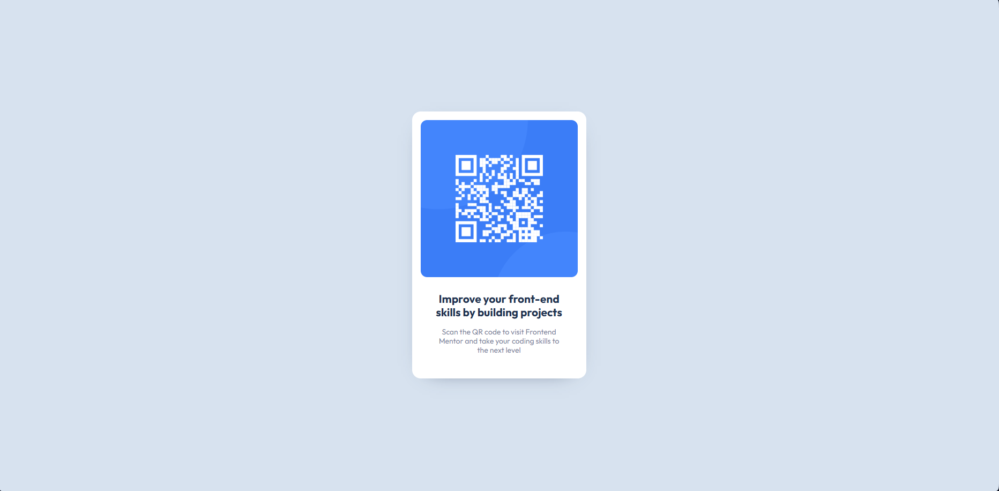
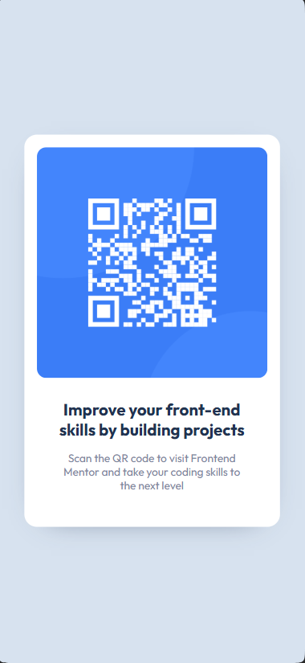

# Frontend Mentor - QR code component

# [QR Code Component]

## 📋 Table of Contents

- [Overview](#overview)
- [Features](#features)
- [Technologies](#technologies)
- [What I Learned](#what-i-learned)
- [Future Development](#future-development)
- [Author](#author)

## 📖 Overview

This is a farily simple challenge using HTML and CSS which taught me the basics about these languajes, it is centered completely in the visuals
and the objective is just to mimic the closest to the original design as possible

### The Challenge

Users should be able to:

- Appreciate a mimic of the challenge presented
- View the optimal layout depending on their device's screen size

## ✨ Features

- **Responsive Design**: Adapted for mobile, tablet, and desktop
- **Centered Div**: The first time I have done this and I'm proud of it

#### Desktop

#### Mobile

### Links

- **Live Site**: [https://your-project.vercel.app](https://your-project.vercel.app)
- **Repository**: [https://github.com/your-username/project](https://github.com/your-username/project)

## 🛠️ Technologies

- **Frontend**:

  - CSS

- **Tools**:

  - Vite

## 💡 What I Learned

### Key Concepts

- **Responsive**: Project adjusts to different screen sizes
- **Centered-Component**: Managed to overcome the challenge of centering something in the screen

### Code Highlights

===Css====
@media(max-width: 600px){
body {
min-width: 100vw;
min-height: 100vh;
max-width: 100vw;
padding: 1.5rem;
}
}
==========

## 🔮 Future Development

Planned features and improvements:

- Most likely won't recieve future editing

## 👤 Author

- **Name**: [Danny Carvajal]
- **GitHub**: [@your-username](https://github.com/danny-carvajal)

---

⭐ If you found this challenge well done, please consider giving it a star on GitHub!
